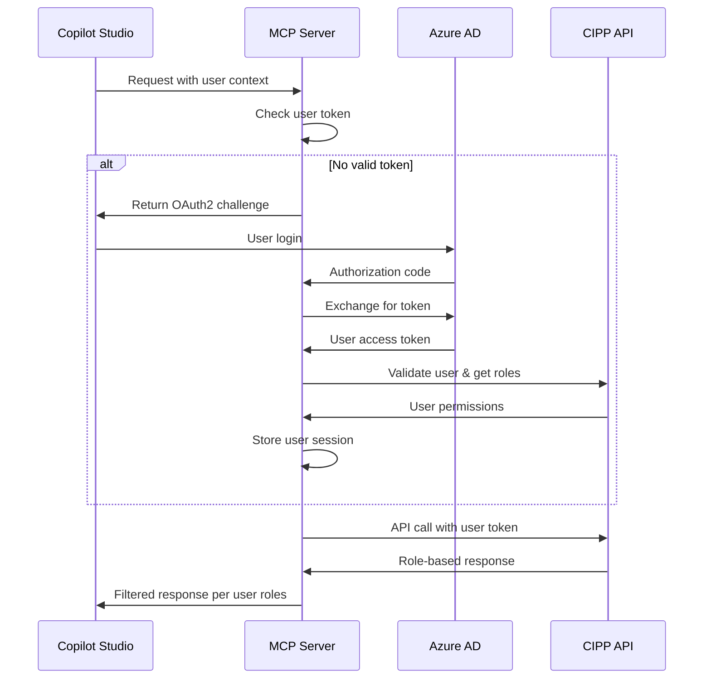

# OAuth2 User-Delegated Authentication Implementation Plan

## Overview
Implement OAuth2 user-delegated authentication for CIPP-MCP server to ensure each Copilot Studio user authenticates with their own CIPP credentials and permissions.

## Current vs. Target Architecture

### Current (Service Account)
```
Copilot Studio → MCP Server → CIPP API
                     ↑
               Single service token
               (same permissions for all users)
```

### Target (User-Delegated)
```
User A → OAuth2 Login → MCP Server → CIPP API (User A permissions)
User B → OAuth2 Login → MCP Server → CIPP API (User B permissions)
User C → OAuth2 Login → MCP Server → CIPP API (User C permissions)
```

## Implementation Steps

### Step 1: Azure App Registration
1. **Create App Registration**
   - Name: `CIPP-MCP-OAuth2-Provider`
   - Supported account types: Single tenant
   - Redirect URI: `https://your-mcp-server.com/oauth/callback`

2. **Configure Authentication**
   - Platform: Web
   - Redirect URIs:
     - `https://your-mcp-server.com/oauth/callback`
     - `https://your-mcp-server.com/oauth/silent-callback` (for token refresh)
   - ID tokens: Enabled
   - Access tokens: Enabled

3. **API Permissions**
   - Microsoft Graph: `User.Read` (for user info)
   - Custom CIPP API permissions (if applicable)

4. **Generate Client Secret**
   - Store in Azure Key Vault

### Step 2: MCP Server OAuth2 Endpoints

Create new OAuth2 controller in MCP server:

```csharp
[ApiController]
[Route("oauth")]
public class OAuth2Controller : ControllerBase
{
    [HttpGet("authorize")]
    public IActionResult Authorize([FromQuery] string client_id, 
                                 [FromQuery] string redirect_uri,
                                 [FromQuery] string scope,
                                 [FromQuery] string state)
    {
        // Redirect to Azure AD OAuth2 authorize endpoint
        // Include CIPP-specific scopes
    }

    [HttpPost("token")]
    public async Task<IActionResult> Token([FromForm] TokenRequest request)
    {
        // Exchange authorization code for access token
        // Validate user against CIPP
        // Return JWT with CIPP roles
    }

    [HttpPost("refresh")]
    public async Task<IActionResult> RefreshToken([FromForm] RefreshTokenRequest request)
    {
        // Refresh expired tokens
        // Maintain CIPP role information
    }
}
```

### Step 3: User Authentication Flow



### Step 4: Token Management

1. **JWT Token Structure**
   ```json
   {
     "sub": "user@domain.com",
     "name": "User Name",
     "cipp_roles": ["GlobalAdmin", "SecurityReader"],
     "cipp_tenants": ["tenant1", "tenant2"],
     "exp": 1234567890,
     "iat": 1234567890
   }
   ```

2. **Token Storage**
   - In-memory cache for active sessions
   - Redis for scale-out scenarios
   - Encrypted tokens for security

3. **Token Validation**
   - Signature verification
   - Expiration checking
   - CIPP role validation on each request

### Step 5: CIPP Role Integration

1. **User Role Lookup**
   ```csharp
   public async Task<CippUserContext> GetUserContext(string userPrincipalName)
   {
       // Call CIPP API to get user roles and tenant access
       var response = await _cippApi.GetAsync($"/api/identity/users/{userPrincipalName}/roles");
       return JsonSerializer.Deserialize<CippUserContext>(response);
   }
   ```

2. **Request Filtering**
   ```csharp
   public async Task<T> ExecuteWithUserContext<T>(Func<Task<T>> operation, CippUserContext userContext)
   {
       // Set request headers with user context
       _httpClient.DefaultRequestHeaders.Add("X-User-Principal", userContext.UserPrincipalName);
       _httpClient.DefaultRequestHeaders.Add("X-User-Roles", string.Join(",", userContext.Roles));
       
       return await operation();
   }
   ```

## Copilot Studio Configuration

### Custom Connector Updates

1. **Authentication Type**: OAuth 2.0
2. **OAuth 2.0 Settings**:
   - Authorization URL: `https://your-mcp-server.com/oauth/authorize`
   - Token URL: `https://your-mcp-server.com/oauth/token`
   - Refresh URL: `https://your-mcp-server.com/oauth/refresh`
   - Scope: `cipp.read cipp.write`

3. **Security**:
   - Client ID: From app registration
   - Client Secret: From Key Vault
   - Use PKCE: Enabled

## Environment Variables

Update `.env` file:

```env
# OAuth2 Configuration
AUTH_MODE=oauth2
OAUTH2_CLIENT_ID=your-app-registration-client-id
OAUTH2_CLIENT_SECRET_NAME=oauth2-client-secret
OAUTH2_TENANT_ID=your-tenant-id
OAUTH2_REDIRECT_URI=https://your-mcp-server.com/oauth/callback

# JWT Configuration
JWT_SECRET_NAME=jwt-signing-key
JWT_ISSUER=https://your-mcp-server.com
JWT_AUDIENCE=cipp-mcp-clients

# CIPP Integration
CIPP_API_BASE_URL=https://your-cipp-instance.com
CIPP_USER_ROLES_ENDPOINT=/api/identity/users/{userPrincipalName}/roles
```

## Security Considerations

1. **Token Security**
   - Short-lived access tokens (15 minutes)
   - Refresh tokens with longer lifetime (24 hours)
   - Secure storage in Key Vault

2. **CORS Configuration**
   - Restrict to Copilot Studio domains
   - Validate redirect URIs

3. **Rate Limiting**
   - Per-user rate limits
   - Role-based throttling

4. **Audit Logging**
   - Log all authentication events
   - Track user actions by role

## Testing Strategy

1. **Unit Tests**
   - OAuth2 flow validation
   - Token generation/validation
   - Role-based filtering

2. **Integration Tests**
   - End-to-end authentication flow
   - CIPP role validation
   - Copilot Studio integration

3. **User Acceptance Testing**
   - Different user roles see appropriate data
   - Permissions are properly enforced
   - Token refresh works seamlessly

## Rollout Plan

1. **Phase 1**: Implement OAuth2 infrastructure
2. **Phase 2**: Add CIPP role integration
3. **Phase 3**: Update Copilot Studio connector
4. **Phase 4**: User testing and refinement
5. **Phase 5**: Production deployment

## Migration Strategy

1. **Backwards Compatibility**
   - Support both service account and OAuth2 modes
   - Gradual user migration
   - Fallback to service account if OAuth2 fails

2. **Configuration Flag**
   ```env
   ENABLE_OAUTH2=true
   FALLBACK_TO_SERVICE_ACCOUNT=true
   ```

## Success Metrics

- ✅ Each user sees only their authorized tenants
- ✅ Role-based access control working correctly
- ✅ No shared service account permissions
- ✅ Audit trail shows individual user actions
- ✅ Performance meets requirements (<2s response time)

## Next Steps

1. Review and approve this implementation plan
2. Create Azure App Registration
3. Implement OAuth2Controller
4. Add JWT token management
5. Test with sample users
6. Update Copilot Studio connector configuration
