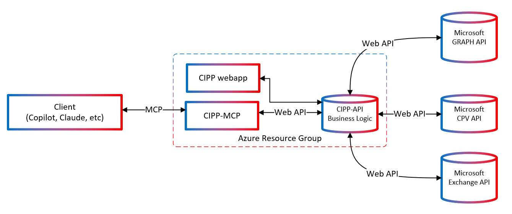

# CIPP-MCP: Model Context Protocol Server for CIPP

[](https://portal.azure.com/#create/Microsoft.Template/uri/https%3A%2F%2Fraw.githubusercontent.com%2Fdavebirr%2FCIPP-MCP%2Fmain%2Fdeployment%2FAzureDeploymentTemplate.json)

CIPP-MCP is a Model Context Protocol server that enables AI assistants to securely interact with CIPP (CyberDrain Improved Partner Portal) functionality. This allows Copilot Studio, Claude Desktop, and other AI tools to perform Microsoft 365 tenant management operations through natural language commands.

> **References:**
> - [MCP Documentation](https://modelcontextprotocol.io/introduction)
> - [Microsoft MCP Blog: Introducing Model Context Protocol (MCP) in Copilot Studio](https://www.microsoft.com/en-us/microsoft-copilot/blog/copilot-studio/introducing-model-context-protocol-mcp-in-copilot-studio-simplified-integration-with-ai-apps-and-agents)
> - [CIPP Feature Request #3975](https://github.com/KelvinTegelaar/CIPP/issues/3975)
> - [MCP tool bindings for Azure Functions](https://learn.microsoft.com/en-us/azure/azure-functions/functions-bindings-mcp?pivots=programming-language-csharp)

## 🚀 Quick Deploy to Azure

CIPP-MCP follows the same **fork-and-deploy pattern** as CIPP-API, ensuring consistency with the CIPP ecosystem.

### Why Separate Repository?
- **Different Technology Stacks**: PowerShell vs C# .NET with different build systems
- **Independent Deployment**: Azure Functions vs different hosting options
- **Independent Release Cycles**: Each component evolves separately
- **Fork-and-Deploy Alignment**: Matches CIPP's established user deployment pattern

### 🌟 Recommended: OAuth2 Deployment for Copilot Studio

**Step 1: Deploy Infrastructure**
[](https://portal.azure.com/#create/Microsoft.Template/uri/https%3A%2F%2Fraw.githubusercontent.com%2Fdavebirr%2FCIPP-MCP%2Fmain%2Fdeployment%2FAzureDeploymentTemplate.json)

- Set **Auth Mode** to `oauth2` for user-delegated authentication
- Use your existing CIPP Key Vault name
- Deploy to the same resource group as your CIPP installation

**Step 2: Complete OAuth2 Setup**
```powershell
# Download and run the OAuth2 setup script
git clone https://github.com/yourusername/CIPP-MCP.git
cd CIPP-MCP/deployment

.\Deploy-OAuth2.ps1 -ResourceGroupName "your-cipp-rg" `
                    -BaseName "your-deployment-basename" `
                    -CippApiUrl "https://your-cipp.azurestaticapps.net" `
                    -ExistingKeyVaultName "your-cipp-keyvault" `
                    -SkipArmDeployment
```

**Step 3: Configure Copilot Studio**
The script outputs exact OAuth2 configuration for your Copilot Studio custom connector.

### Alternative: Legacy Service Authentication

1. **Fork this repository** to your GitHub account
2. **Deploy to Azure** with **Auth Mode** set to `keyvault`
3. **Configure authentication** by adding your CIPP credentials to Key Vault
4. **Connect to Copilot Studio** or VS Code for AI-powered tenant management

## 🤖 Copilot Studio Integration

### Quick Setup Steps
1. **Create your Copilot Studio agent** with the [sample prompt](Docs/Copilot-Studio-Sample-Agent.md)
2. **Add MCP custom connector** following these steps:
   - Click **Tools** in left navigation → **+ New Tool**
   - Select **Custom Connector** (opens Power Apps environment)
   - **+ New Custom Connector** → **Import from GitHub**
   - **Connector Type**: Custom
   - **Branch**: Dev  
   - **Connector**: MCP-Streamable-HTTP
   - Click **Continue**
3. **Configure connector settings**:
   - **Logo**: Upload CIPP logo (optional)
   - **Description**: "CIPP-MCP Server for Microsoft 365 tenant management"
   - **Host**: `cipp-mcp.roanoketechhub.com` (or your deployment URL)
   - **Base URL**: `/mcp`
4. **Set authentication**: 
   - **🌟 Recommended**: Click **Security** → **OAuth 2.0** for individual user authentication
     - [Complete OAuth2 Setup Guide](./Docs/OAuth2-Authentication-Guide.md)
     - Users authenticate individually and inherit their CIPP permissions
   - **Alternative**: "No Authentication" for testing environments only
   - **See**: [Authentication Options Guide](Docs/Authentication-Options.md) for detailed comparison

📖 **Full Setup Guide**: [Copilot Studio Sample Agent](Docs/Copilot-Studio-Sample-Agent.md)

## 🏗️ Architecture

CIPP-MCP integrates seamlessly with the existing CIPP ecosystem by acting as an authenticated proxy between AI agents and the CIPP-API.

### Current CIPP Architecture
- **CIPP Frontend**: React SPA hosted as Azure Static Web App
- **CIPP-API**: PowerShell Azure Functions for Microsoft Graph API operations

### CIPP-MCP Integration
- **Deployment**: Azure Function App alongside existing CIPP infrastructure
- **Language**: C# (.NET 9)
- **Protocol**: Model Context Protocol over HTTP
- **Authentication**: Leverages existing CIPP Static Web Apps authentication



### Integration Flow
1. **AI Agent/Copilot** sends MCP request to CIPP-MCP endpoint
2. **CIPP-MCP Server** receives request and authenticates using SWA cookies
3. **CIPP-MCP** calls appropriate CIPP-API PowerShell functions via HTTP
4. **CIPP-API** executes business logic and Microsoft Graph operations
5. **CIPP-MCP** streams formatted response back to AI agent

### Security Model
- **Controlled Gateway**: CIPP-MCP exposes only explicitly configured tools
- **Authentication Proxy**: Uses existing CIPP Static Web Apps authentication
- **No Direct Access**: AI agents cannot directly access CIPP-API
- **Audit Trail**: All requests logged through Application Insights

- **Azure Function App**: Hosts the MCP server with automatic scaling
- **Key Vault Integration**: Secure storage for CIPP authentication
- **Static Web Apps Proxy**: Leverages existing CIPP authentication flow
- **Application Insights**: Comprehensive monitoring and logging

## 🧪 Local Development

1. **Clone and setup**:
   ```bash
   git clone https://github.com/davebirr/CIPP-MCP.git
   cd CIPP-MCP/src
   dotnet restore
   ```

2. **Configure environment** (copy `.env.template` to `.env`):
   ```bash
   AUTH_MODE=browser
   CIPP_API_BASE_URL=https://your-cipp.azurestaticapps.net
   CIPP_USER_EMAIL=your-email@domain.com
   BROWSER_AUTH_COOKIE=your-swa-cookie
   ```

3. **Run locally**:
   ```bash
   dotnet run
   ```

4. **Test the server**:
   - Health check: http://localhost:5000/health
   - VS Code: Add MCP Server with URL `http://localhost:5000`

## 📋 Prerequisites

- **Existing CIPP deployment** in Azure (required)
- **Azure subscription** with deployment permissions
- **GitHub account** for repository forking
- **[.NET 9 SDK](https://dotnet.microsoft.com/download/dotnet/9.0)** for local development

### Local Development Requirements
- .NET 9 SDK with explicit reference to `Microsoft.Extensions.Hosting` version `9.0.0-preview.3.24172.9`
- Azure CLI (for deployment)
- PowerShell 7+ (for testing scripts)
- Visual Studio or VS Code (recommended)

## 🛠️ Available MCP Tools

CIPP-MCP provides 15 comprehensive tools for Microsoft 365 tenant management, carefully selected from the 200+ CIPP-API endpoints to provide the most valuable AI-assisted operations.

### Tenant Management (5 tools)
- **test_cipp_connection**: Test connection to CIPP-API and validate authentication
- **get_tenant_dashboard**: Get comprehensive tenant dashboard with key metrics and insights
- **list_tenants**: List all customer tenants managed by CIPP with health status
- **get_tenant_details**: Get detailed information about a specific tenant
- **get_tenant_domain_health**: Domain health checks and DNS validation

### User Management (5 tools)
- **list_users**: List users in a specific tenant with filtering options
- **get_user_details**: Get comprehensive user profile information
- **list_user_licenses**: List user licenses and assignments for analysis
- **get_user_sign_in_activity**: Check user sign-in activity and last logon events
- **get_user_analytics**: Get comprehensive user analytics and insights for a tenant

### Device Management (5 tools)
- **list_devices**: List managed devices in a specific tenant
- **get_device_details**: Get detailed information about a specific device
- **get_device_compliance**: List device compliance status and policies
- **list_device_applications**: List installed applications on managed devices
- **get_device_analytics**: Get comprehensive device analytics and compliance overview

### AI Use Cases
The tools are designed for complex AI-driven scenarios such as:
- **Complex Reporting**: "Every P1 licensed user that logged in last Friday from an iPad using Outlook"
- **Health Check Automation**: Automated tenant health assessments
- **Security Analysis**: Risk pattern detection across multiple tenants
- **Compliance Monitoring**: Automated compliance reporting and alerting

> **Available CIPP Endpoints**: CIPP-API provides 200+ HTTP endpoints across tenant management, user administration, device management, security, and Exchange operations. The current MCP implementation focuses on read-only operations for safety, with the most valuable endpoints for AI-assisted management. See the [original project documentation](https://github.com/KelvinTegelaar/CIPP) for the complete endpoint catalog.

## 🔐 Authentication Modes

CIPP-MCP supports multiple authentication methods for different use cases:

### 1. OAuth2 User-Delegated (🌟 Recommended for Copilot Studio)
- **Each user authenticates individually** with their own credentials
- **Users inherit their existing CIPP roles** and permissions
- **Perfect for Copilot Studio integration** with multiple users
- **Complete audit trail** and compliance
- **No shared credentials** or service accounts
- **[📖 Detailed OAuth2 Setup Guide](./Docs/OAuth2-Authentication-Guide.md)**

### 2. Key Vault Mode (Recommended for Service-to-Service)
- **Retrieves credentials from Azure Key Vault** using managed identity
- **No hardcoded secrets** in configuration
- **Automatic secret rotation** support
- **Suitable for backend integrations** and automation

### 3. Browser Mode (Development Only)
- **Uses Static Web Apps authentication cookie** from browser
- **Suitable for development and testing**
- **Not recommended for production use**

### 4. Manual Mode (Legacy)
- **Requires manual token management**
- **Not recommended for new deployments**

**Configuration**: Set the `AUTH_MODE` environment variable:
- `oauth2` - OAuth2 user-delegated authentication (🌟 for Copilot Studio)
- `keyvault` - Azure Key Vault (for service-to-service)
- `browser` - Local browser authentication (development)
- `manual` - Manual token management (legacy)

## 📋 Prerequisites

- Existing CIPP deployment in Azure
- Azure subscription with deployment permissions
- GitHub account for repository forking

## 🚀 Production Deployment

### ⚠️ Critical Deployment Notes

**IMPORTANT**: The ARM template has been configured for ASP.NET Core Web App deployment, NOT Azure Functions. Ensure your deployment uses:
- **Runtime Stack**: `DOTNETCORE|9.0` (NOT `DOTNET|9.0`)
- **App Type**: Web App (NOT Function App)
- **Framework**: ASP.NET Core 9.0

**Common Issues & Solutions**:
1. **Runtime Stack Error**: If you see nginx/PHP serving instead of .NET, verify the `linuxFxVersion` is set to `DOTNETCORE|9.0`
2. **Custom Domain**: Use Azure DNS for seamless SSL certificate management
3. **Authentication**: Managed Identity with Key Vault access is required for production

### Option 1: One-Click Deploy
1. Fork this repository
2. Update the "Deploy to Azure" button URL with your username
3. Click deploy and fill in parameters
4. **Verify runtime stack** is set to `DOTNETCORE|9.0`

### Option 2: Manual Deployment
See [deployment/README.md](deployment/README.md) for detailed instructions

### Option 3: Custom Domain Setup
For production deployments with custom domains:
1. Deploy using ARM template with correct runtime stack
2. Configure DNS records in Azure DNS or your provider
3. Create Azure managed certificate for SSL/TLS
4. Enable HTTPS-only enforcement
5. Test all endpoints on the custom domain

**Example Production Setup**: `https://cipp-mcp.roanoketechhub.com`

## 🔧 Configuration

After deployment, configure authentication in Key Vault:

```bash
# Required secrets for production
CIPP-APPLICATION-ID=your-app-id
CIPP-APPLICATION-SECRET=your-app-secret  
CIPP-REFRESH-TOKEN=your-refresh-token
```

## 📊 Monitoring

- **Application Insights**: Automatic logging and performance monitoring
- **Health Endpoints**: Built-in health checks at `/health`
- **Error Tracking**: Comprehensive error logging and alerting

## 🔄 CI/CD Pipeline

The ARM template includes:
- Continuous deployment from GitHub
- Automatic updates on repository changes
- Blue-green deployment for zero downtime

## 🛡️ Security Features

- **Managed Identity**: No stored credentials in application
- **Key Vault Integration**: Secure secrets management
- **HTTPS Enforcement**: TLS 1.2+ required
- **Authentication Required**: All endpoints protected

## 🔧 Troubleshooting

### Common Deployment Issues

#### Runtime Stack Problems
**Symptom**: Seeing nginx welcome page or PHP instead of .NET application
**Cause**: Incorrect runtime stack configuration in ARM template
**Solution**: Ensure `linuxFxVersion` is set to `DOTNETCORE|9.0` (not `DOTNET|9.0`)

```json
"siteConfig": {
  "linuxFxVersion": "DOTNETCORE|9.0",
  "alwaysOn": true
}
```

#### Authentication Failures
**Symptom**: MCP tools returning 401/403 errors
**Cause**: Missing Key Vault access or incorrect managed identity configuration
**Solution**: Verify managed identity has Key Vault secrets access

#### Custom Domain SSL Issues
**Symptom**: Certificate warnings or HTTP-only access
**Cause**: Missing SSL certificate or DNS configuration
**Solution**: Use Azure managed certificates with proper DNS validation

### Verification Commands
```bash
# Test deployment health
curl https://your-app.azurewebsites.net/health

# Test MCP endpoint
curl -X POST https://your-app.azurewebsites.net/mcp \
  -H "Content-Type: application/json" \
  -d '{"jsonrpc": "2.0", "method": "tools/list", "id": 1}'

# Verify runtime stack
az webapp config show --name your-app --resource-group your-rg --query "linuxFxVersion"
```

## 🧪 Testing & Development

### Running Tests
This project uses [xUnit](https://xunit.net/) for unit and integration testing.

```bash
# Run all tests
dotnet test

# Add xUnit to test projects
dotnet add package xunit
dotnet add package xunit.runner.visualstudio
```

### Development Testing Scripts
```bash
# Test authentication
.\Scripts\Test-Authentication.ps1

# Test all MCP tools
.\Scripts\Test-Development-Modular.ps1

# Validate deployment
.\Scripts\Test-Production.ps1
```

### Installing Preview Packages
For advanced AI schema support:
```bash
dotnet add package Microsoft.Extensions.AI --prerelease
```

Run the comprehensive test suite:

```bash
# Test authentication
.\Scripts\Test-Authentication.ps1

# Test all MCP tools
.\Scripts\Test-Development-Modular.ps1

# Validate deployment
.\Scripts\Test-Production.ps1
```

## 📚 Documentation

- [Authentication Guide](AUTHENTICATION.md)
- [Copilot Studio Authentication Options](Docs/Authentication-Options.md)
- [Integration Guide](INTEGRATION-GUIDE.md) 
- [Deployment Instructions](deployment/README.md)
- [Copilot Studio Sample Agent](Docs/Copilot-Studio-Sample-Agent.md)
- [Copilot Studio Quick Setup](Docs/Copilot-Studio-Quick-Setup.md)
- [API Documentation](Docs/)

## 🤝 Contributing

1. Fork the repository
2. Create a feature branch
3. Make your changes
4. Test thoroughly
5. Submit a pull request

## 📞 Support

- **Issues**: Use GitHub Issues for bug reports and feature requests
- **Documentation**: Check the Docs/ directory for detailed guides
- **Community**: Join the [CIPP Discord community](https://discord.gg/cipp)
- **CIPP Project**: Visit [CIPP on GitHub](https://github.com/KelvinTegelaar/CIPP)

## 🤝 Contributing

We welcome contributions! See [CONTRIBUTING.md](CONTRIBUTING.md) for guidelines.

1. Fork the repository
2. Create a feature branch
3. Make your changes with tests
4. Submit a pull request

## 📄 License

This project follows the same license terms as CIPP. Please see the main [CIPP repository](https://github.com/KelvinTegelaar/CIPP) for license details.

## 🏷️ Version

**Current Version**: 1.0.1

### Release Notes v1.0.1
- ✅ **Production-ready deployment** with ARM templates (Web App, not Function App)
- ✅ **Runtime stack fix**: Corrected to `DOTNETCORE|9.0` for proper ASP.NET Core execution
- ✅ **Custom domain support**: Full SSL/TLS with Azure managed certificates
- ✅ **Comprehensive authentication system** (browser, development, Key Vault)
- ✅ **15 MCP tools** covering tenant, user, device, and security management
- ✅ **CI/CD pipeline** with GitHub Actions and optimized build paths
- ✅ **Complete documentation** and testing framework with troubleshooting guide
- ✅ **Production validation**: Deployed and tested at `cipp-mcp.roanoketechhub.com`

### Known Issues & Solutions
- **Runtime Stack**: Must use `DOTNETCORE|9.0` not `DOTNET|9.0` - see troubleshooting section
- **Authentication**: Requires managed identity with Key Vault access permissions
- **Custom Domains**: Use Azure DNS for seamless certificate management

---

**CIPP-MCP v1.0.1** - Extending CIPP with AI capabilities through the Model Context Protocol.

> This is a community project that enhances CIPP with AI integration. An existing CIPP deployment is required for operation.
